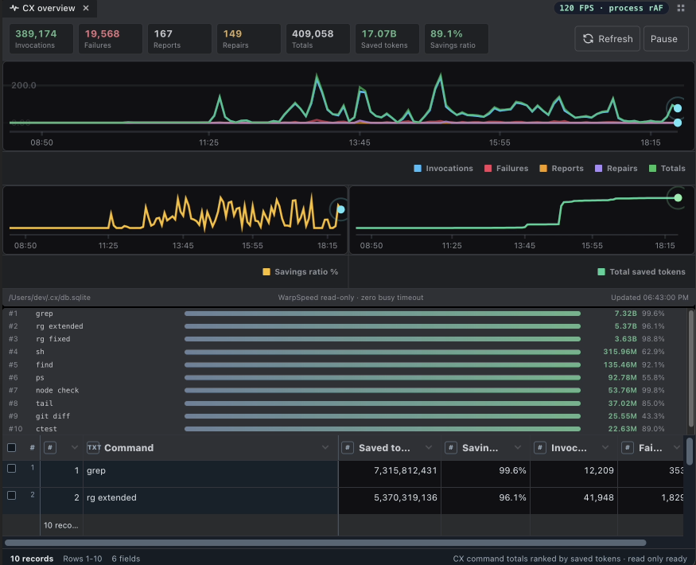
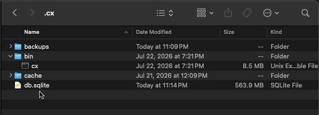
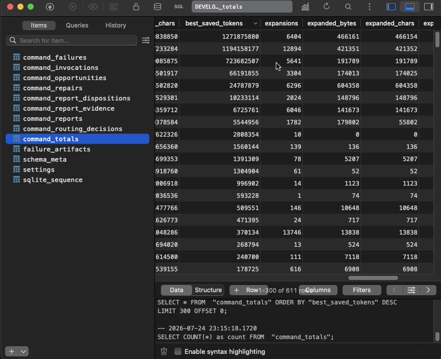

<div align="center">

# cx

### Less shell noise. More room to reason.

**Real commands. Real exit codes. Inspectable savings.**

`cx` is an independent local Rust CLI built for OpenAI Codex workflows. It runs
development commands, keeps the evidence a coding agent needs, and records
exactly how much output it saved in an optional local SQLite ledger.

CX is not an OpenAI product, and no OpenAI endorsement is implied.

[](https://github.com/contextlimit/cx/actions/workflows/ci.yml)
[](https://www.npmjs.com/package/@contextlimit/cx)
[](Cargo.toml)
[](LICENSE)
[](#inspectable-local-insights)
[](https://discord.gg/5esGQ5qyrw)
[](https://x.com/contextlimit)
[](http://youtube.com/@contextlimit)
[](https://stackoverflow.com/users/119301/contextlimit?tab=profile)

[Install](#install) |
[Quick start](#quick-start) |
[Insights](#inspectable-local-insights) |
[Commands](#official-command-families) |
[Safety](#truthful-by-design) |
[Contributing](CONTRIBUTING.md)



<sub><strong>CX Insights UI preview, coming soon.</strong> The shipped interface
today is the CLI plus the same local SQLite database shown below. This screenshot
is one long-running development dataset, not a universal savings guarantee.</sub>

</div>

## Why CX

AI coding agents regularly consume thousands of lines from diffs, tests, logs,
searches, generated files, and process inventories. Blind truncation saves
context but can hide the one line that matters. Raw output preserves truth but
wastes context.

CX takes the middle path:

| Need | CX contract |
| --- | --- |
| Run the real tool | Direct argv execution through `std::process::Command` |
| Preserve the verdict | The child process exit code remains authoritative |
| Reduce output | Command-specific projections retain decision evidence |
| Recover failures | Raw nonzero output is linked from `~/.cx/cache/failures` |
| Verify savings | Raw, emitted, saved, and expanded metrics live in SQLite |
| Catch wrong summaries | `cx report` records successful-but-incorrect output too |
| Explore unsupported tools | Default passthrough keeps native output exact and records opportunities |

CX is intentionally narrow. It is not a shell, daemon, MCP server, memory
system, hosted proxy, or remote telemetry service.

## Install

### npm

Requires Node.js 18 or newer:

```sh
npm install -g @contextlimit/cx
cx --version
```

The npm package downloads the matching native binary from the
[`contextlimit/cx` GitHub release](https://github.com/contextlimit/cx/releases),
verifies its SHA-256 checksum, and installs it inside the npm package. It does
not write to `~/.cx` during package installation.

### Homebrew

```sh
brew install contextlimit/tap/cx
cx --version
```

The formula installs the same checksum-pinned native binary published in the
GitHub release. The tap lives at
[`contextlimit/homebrew-tap`](https://github.com/contextlimit/homebrew-tap).

### From source

Requirements:

- macOS or Linux
- a current stable Rust toolchain
- `~/.local/bin` on `PATH`

```sh
git clone https://github.com/contextlimit/cx.git
cd cx
./scripts/install.sh
cx --version
```

The installer:

- builds `cx` in release mode;
- installs the runtime binary at `~/.cx/bin/cx`;
- writes a small wrapper at `~/.local/bin/cx`;
- creates `~/.config/cx` and `~/.cx/cache`;
- leaves any existing `~/.cx/db.sqlite` untouched.

If `~/.local/bin` is not on `PATH`:

```sh
export PATH="$HOME/.local/bin:$PATH"
```

### Manual binary install

```sh
cargo build --release --bin cx
mkdir -p ~/.cx/bin ~/.local/bin
cp target/release/cx ~/.cx/bin/cx
printf '%s\n' \
  '#!/usr/bin/env sh' \
  'exec "$HOME/.cx/bin/cx" "$@"' \
  > ~/.local/bin/cx
chmod +x ~/.local/bin/cx
```

### Agent Instruction

Installing CX puts the binary on `PATH`; it does not configure Codex. Open
`~/.codex/AGENTS.md` and add **one** of the following blocks.

No setup command is required. Unsupported-command passthrough and local
invocation metrics are enabled by default. The first `cx -- ...` command creates
`~/.cx/db.sqlite` and records output metrics plus a redacted command shape. Full
command text, source labels, and response previews remain opt-in.

#### Simple Codex instruction

Add this compact block to `~/.codex/AGENTS.md`:

```text
## CX command execution

- Prefix every feasible external command with `cx --`.
- Use `cx sh -lc '<command>'` when pipes, redirects, variables, globs, heredocs, or other shell syntax are required.
- If CX output is clearly wrong, empty, or misleading, run `cx report <the same cx command>` before using the smallest useful native fallback.
```

#### Advanced Codex instruction

Add this block to `~/.codex/AGENTS.md` when Codex should also preserve exact
evidence and protect local telemetry:

```text
## CX command execution

- Prefix every feasible external command with `cx --`. Auto mode routes supported shapes through CX compaction and directly executes unsupported shapes by default.
- Use `cx sh -lc '<command>'` or `cx sh <<'BASH' ... BASH` only when shell parsing is required. Do not expect direct argv execution to interpret pipes, redirects, environment assignments, globs, or heredocs.
- For a remote multiline script, use `cx -- ssh <host> "bash -s" <<'REMOTE' ... REMOTE`.
- Use `cx -- git diff` for compact human review. Use `cx -- git evidence-diff [COMMIT_OR_RANGE] [-- <paths...>]` for exact patch evidence consumed by another tool.
- Preserve every `[full output: ...]` pointer emitted after a nonzero command; it identifies recoverable native output.
- If CX output is clearly wrong, empty, truncated, or misleading even when the command exits zero, run `cx report <the same cx command>` before using a narrow native fallback.
- Do not use `cx proxy`; unsupported commands use `cx -- <command...>`.
- Keep fallback output narrow, for example `git diff -- <path>`, `rg -n <pattern> <path>`, or a fixed source range.
- Never delete, reset, overwrite, or migrate the real `~/.cx/db.sqlite` during tests. Point experiments at `CX_INSIGHTS_DB_PATH=<project>/.tmp/cx.sqlite`.
- Invocation metrics and redacted command shapes are recorded locally by default. Command text, sources, failure responses, and response previews are separate settings; do not enable them unless the user wants those local values retained.
```

See [the passthrough contract](docs/features/passthrough.md) and
[insights settings](docs/features/insights.md) for the exact execution and
privacy controls.

## Quick Start

Auto mode is the normal agent-facing entrypoint:

```sh
cx -- git status
cx -- git diff
cx -- rg -n "Command::output" src
cx -- cargo test
cx -- ps -axo pid,ppid,etime,command
```

`cx -- <command...>` first tries the official CX route. If the command shape is
unsupported or intentionally parser-risky, it runs through exact direct
passthrough by default.

Shell syntax remains explicit:

```sh
cx -- bash -lc 'git status --short | wc -l'
cx sh -lc 'printf "%s\n" "$HOME"'
```

## What It Looks Like

Large output becomes a bounded decision surface. On failure, the raw evidence
remains recoverable:

```text
3 failed, 184 passed

failures:
- tests/parser.rs::leading_dash_pattern
- tests/runner.rs::inherited_descriptor
- tests/insights.rs::redacted_command_text

[full output: ~/.cx/cache/failures/pytest/1785000000000-12345.log]
```

CX does not manufacture a success verdict from incomplete data. A command family
only compacts output when its projection can be derived from real command or
file content.

## Inspectable Local Insights

Local insights are **enabled by default**. CX has no vendor analytics service.
The first command routed through CX creates:

```text
~/.cx/db.sqlite
```

The default records invocation metrics and a redacted command shape. It does
not retain full command text, argv JSON, source labels, failure responses, or
response previews. Disable passive invocation recording with:

```sh
cx insights settings --set record_invocations=false
```

For a process-level opt-out that performs no insights writes:

```sh
CX_DISABLE_INSIGHTS=1 cx -- <command...>
```

Command text remains a separate, optional setting:

```sh
cx insights settings --set record_command_text=true
```

CX redacts obvious tokens, passwords, API keys, and secret-like values before
storage, but redaction is conservative. Leave command text and source recording
off unless you want that information in your local database.

### Settings

View the current values and database location with:

```sh
cx insights settings
```

Every public setting is a Boolean and can be changed with the command and
argument shown below:

| Setting | Default | What it controls | CLI command | Arguments |
| --- | --- | --- | --- | --- |
| `record_invocations` | `true` | Record invocation, exit-code, and output-savings metrics | `cx insights settings --set` | `record_invocations=<true\|false>` |
| `record_command_text` | `false` | Store redacted readable command text and argv JSON | `cx insights settings --set` | `record_command_text=<true\|false>` |
| `record_command_shape` | `true` | Store a redacted command shape and stable shape hash | `cx insights settings --set` | `record_command_shape=<true\|false>` |
| `record_sources` | `false` | Store command output source or target labels | `cx insights settings --set` | `record_sources=<true\|false>` |
| `record_failures` | `false` | Record actionable failed-command details | `cx insights settings --set` | `record_failures=<true\|false>` |
| `record_failure_responses` | `false` | Store bounded redacted CX and native failure responses | `cx insights settings --set` | `record_failure_responses=<true\|false>` |
| `record_response_previews` | `false` | Store bounded redacted emitted and native response previews | `cx insights settings --set` | `record_response_previews=<true\|false>` |
| `passthrough_unsupported_commands` | `true` | Directly execute unsupported command families through `cx --` | `cx insights settings --set` | `passthrough_unsupported_commands=<true\|false>` |
| `command_optimizations` | `true` | Apply optional CX command repairs and optimizations | `cx insights settings --set` | `command_optimizations=<true\|false>` |
| `compact_document_search_results` | `false` | Permit compaction of grep/search results from document and text files | `cx insights settings --set` | `compact_document_search_results=<true\|false>` |

For example:

```sh
cx insights settings --set record_command_text=true
cx insights settings --set record_invocations=false
```

<table>
  <tr>
    <td align="center">
      
      <br>
      <sub>The runtime binary, cache, backups, and local SQLite database are ordinary local files under <code>~/.cx</code>.</sub>
    </td>
  </tr>
  <tr>
    <td align="center">
      
      <br>
      <sub>Open the ledger with any SQLite browser. The dashboard is not a hidden source of truth.</sub>
    </td>
  </tr>
</table>

Useful commands:

```sh
cx insights summary
cx insights presentation
cx insights recent --limit 20
cx insights expansions --limit 20
cx insights failures --limit 20
cx insights reports --status open
cx insights opportunities --limit 20
cx insights export --format json --limit 25
```

The database tracks:

- raw and emitted bytes, characters, lines, and estimated tokens;
- positive savings and positive expansion separately;
- process, official command family, and optional redacted command shape;
- failures and recovery-artifact coverage;
- command-quality reports, dispositions, and repairs;
- rejected routing decisions;
- unsupported passthrough opportunities.

Estimated tokens describe output processed by CX. They are not model-provider
billing records, and an 80% command-output saving does not imply an 80% reduction
in an entire conversation or invoice.

## Report Incorrect Output

Nonzero exits are not the only failure mode. A summary can exit successfully and
still be wrong, empty, or misleading.

```sh
cx report cx -- rg -n "route|path" tests
cx report cx -- node app/test.mjs
```

`cx report` records the normalized command identity and the best unambiguous
local evidence without rerunning the command. Reports remain inspectable and can
be classified as resolved, native parity, not reproducible, or denied with a
structured reason.

## Official Command Families

Official support means the command has an explicit parser, routing contract,
fake-binary forwarding coverage, evidence-retention tests where compaction
matters, failure behavior, and installed-binary proof.

| Area | Official surface |
| --- | --- |
| Git | `status`, `diff`, `log`, `show`, `evidence-diff`, `conflict-diff` |
| Files | `read`, `cat`, `head`, `tail`, `sed`, `nl`, `ls`, `find` |
| Search | `grep`, `rg` |
| Processes | `ps` |
| Tests | `pytest`, `cargo test`, `go test`, `ctest` |
| Build and syntax | `tsc`, `node`, `cmake build` |
| Containers | `docker ps`, `docker logs`, `kubectl logs` |
| Shell boundary | `sh` and explicit shell passthrough |
| Product quality | `report`, `insights` |

See the [complete feature catalog](docs/features/index.md) for accepted command
shapes, internal conversions, output guarantees, and insights labels.

## Examples

- [Read and search](examples/read-and-grep.md)
- [Git review and exact evidence](examples/git.md)
- [Build and test workflows](examples/build-and-test.md)
- [Container and cluster logs](examples/container-logs.md)
- [Smart-read plugin integration](examples/smart-read-plugin.md)

## Compact Review Versus Exact Evidence

CX does not apply one output policy to every command.

- `cx -- git diff` is compact review output by default.
- `cx -- git evidence-diff` is exact raw patch evidence.
- explicit source ranges such as `cx -- sed -n '120,180p' src/lib.rs` remain exact;
- requested text and document formats remain exact by default;
- generated blobs and large unstructured output remain bounded.

Use the exact surface when another system needs byte-for-byte evidence.

## How It Works

```text
agent
  |
  v
CX parser and auto router
  |
  +--> official command module
  |       |
  |       v
  |    direct child process
  |       |
  |       v
  |    file-backed stdout/stderr capture
  |       |
  |       v
  |    command-specific projection
  |
  +--> optional exact unsupported passthrough
          |
          v
stdout + stderr + real exit code
          |
          v
optional local SQLite metrics
```

The file-backed process boundary avoids a common pipe hang where a descendant
inherits stdout or stderr after the direct child exits.

## Truthful By Design

- Direct commands do not silently pass through a shell.
- Exit codes come from the real command.
- Filters operate on real captured output.
- Failure artifacts preserve nonzero raw evidence when available.
- Tiny truthful summaries can expand output, and CX records that expansion.
- Insights recording, command text, source labels, failure responses, and
  passthrough are separate settings.
- Reinstalling the binary does not delete the insights database.
- Tests use isolated temporary databases, never the real `~/.cx/db.sqlite`.

High-risk implementation areas are the runner boundary, grep dialect handling,
Clap preprocessing, exact-output routing, and insights schema migrations.

## Validation

The full release gate is:

```sh
cargo test
cargo fmt --check
cargo clippy --all-targets -- \
  -W clippy::too_many_lines \
  -W clippy::cognitive_complexity
cargo bench --bench cx_hot_paths --no-run
cargo bench --bench cx_iai_hot_paths --no-run
cargo build --release --bin cx
cargo package
./scripts/install.sh
```

Output-metric tests must prove both reduction and evidence retention. Savings
without the lines needed to make the right decision are not a successful CX
feature.

## Adjacent Projects

CX is part of a growing ecosystem of tools that reduce context waste in coding
agent workflows:

- [LeanCTX](https://github.com/yvgude/lean-ctx) explores a broad local context
  management layer.
- [RTK](https://github.com/rtk-ai/rtk) provides a broad command-proxy surface.

CX focuses on explicit command contracts, recoverable command truth, and a
directly inspectable local quality and savings ledger.

## Community

- Discord: [discord.gg/5esGQ5qyrw](https://discord.gg/5esGQ5qyrw)
- X: [x.com/contextlimit](https://x.com/contextlimit)
- YouTube: [youtube.com/@contextlimit](http://youtube.com/@contextlimit)
- Stack Overflow: [contextlimit](https://stackoverflow.com/users/119301/contextlimit?tab=profile)
- Bugs and command-quality reports: [GitHub Issues](https://github.com/contextlimit/cx/issues)
- Security: [SECURITY.md](SECURITY.md)

Contributions are welcome. Start with [CONTRIBUTING.md](CONTRIBUTING.md), and
read the [Code of Conduct](CODE_OF_CONDUCT.md) before participating.

## Roadmap

- Ship the read-only Insights UI previewed above.
- Promote high-value passthrough opportunities into tested official wrappers.
- Add npm trusted publishing after the first package establishes the namespace.

## License

CX is available under the [MIT License](LICENSE).
